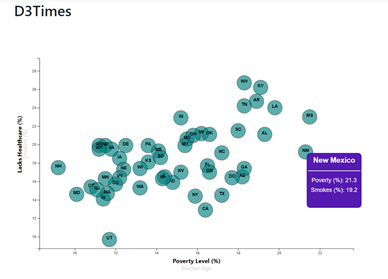

# Visualizing Data using D3.js

Using the D3 techniques, a scatter plot is created to show the data variables such as `Healthcare vs. Poverty` and `Smokers vs. Age`.

* States are represented with circles. 
  
* State abbreviations are included in each circle.
  
* Additional demographics are used for additional labels on the x and y axes. 

* Click events were added so that users can decide which data to display.
  
* Circle locations are animated as well as the range of the axes. 
  

    

### The Data

The data set included with the assignment is based on 2014 ACS 1-year estimates: [https://factfinder.census.gov/faces/nav/jsf/pages/searchresults.xhtml](https://factfinder.census.gov/faces/nav/jsf/pages/searchresults.xhtml), but you are free to investigate a different data set. The current data set includes data on rates of income, obesity, poverty, etc. by state. MOE stands for "margin of error."

### Copyright

Trilogy Education Services © 2019. All Rights Reserved.
